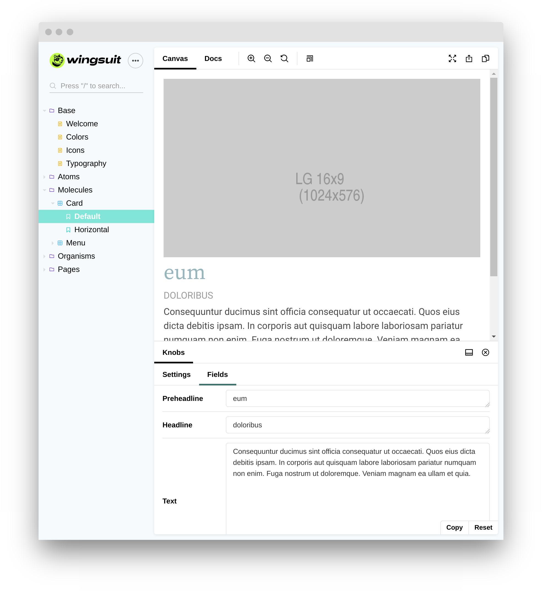
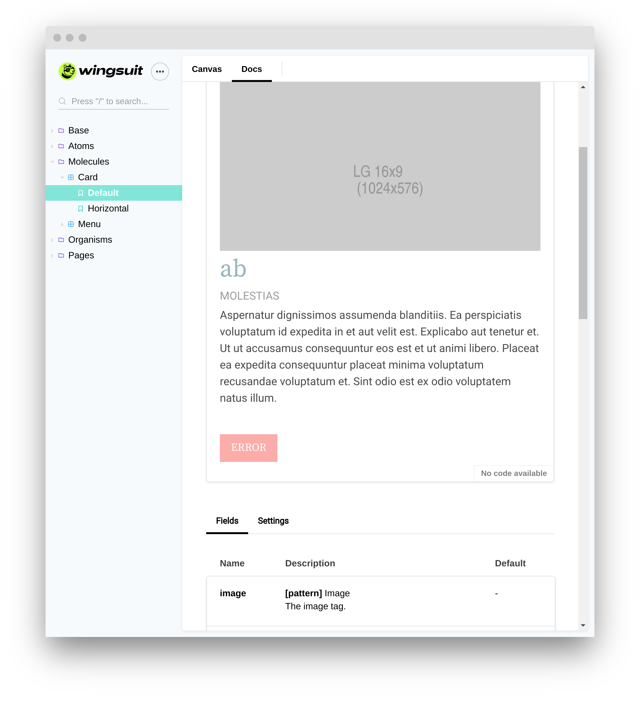

Wingsuit is a design system for twig based UI components. You can develop your components independently in [Storybook](https://storybook.js.org/). After finalizing your component, you can use it in other apps like drupal. 

The `wingsuit.yml`, an extended variant of the [ui_patterns.yml](https://ui-patterns.readthedocs.io/en/8.x-1.x/content/patterns-definition.html), is the heart of each component. 

<b>Wingsuit uses the following configuration files to:</b>

### Generate Storybook stories
Each variant is a Storybook story. Fields and settings are editable with [knobs](https://github.com/storybookjs/storybook/tree/master/addons/knobs).

### Automatic Storybook documentation
A documentation page is created directly from the wingsuit.yml. 

### Drupal integration
With the [wingsuit_companion](https://www.drupal.org/project/wingsuit_companion) module, patterns can be used with zero configuration in drupal. 
[SCREENSHOT]

### Frontend frameworks
Wingsuit ships with [Tailwind CSS](https://tailwindcss.com/) and [Alpine.js](https://github.com/alpinejs/alpine). 

You can [customize](../../configurations/custom-webpack-config) the webpack configuration and integrate your favorite frontend frameworks.

### Stay in sync
One big challenge for design systems is to stay in sync between apps.
Wingsuit solves this problem with a common component configuration: `wingsuit.yml`.
