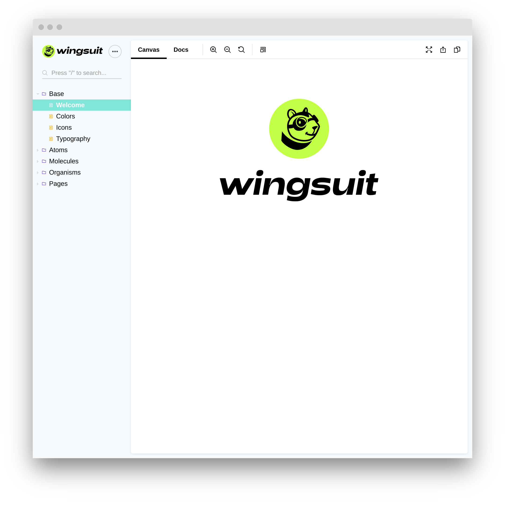

Get started using the automated command line tool. This command creates a Wingsuit demo project. 
The demo page uses the atomic design principle to structure the patterns.

```
npx @wingsuit-designsystem/cli init
```

After the installation succeeds, Storybook will open and you can browse the Wingsuit demo page.



## Get an overview
A good starting point is to have a look at the design system components, which you will find at `source/patterns/default`. Additional Storybook presentation templates are located at  `apps/storybook/patterns`.

A typical component includes a `pattern.wingsuit.yml`, a `twig template`,  and optionally a `css file` and/or a `behavior javascript` file. 

### Create a new component
Another good starting point is to create a [new component](../create-component-guide).
